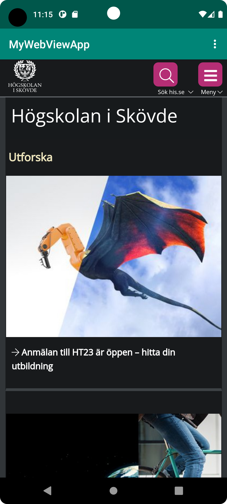
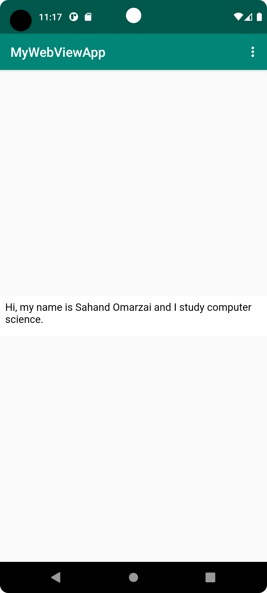

# Rapport

**
Det 1 som gjordes var att forka webview appen från github.
Det 2 problemet löstes genom att hitta filen strings.xml och ändra namnet på appen. 
Det 3 problemet löstes genom att lägga till en rad kod i filen AndroidManifest.xml, finns på rad nr 32 i snuttkoden.
Det 4 problemet löstes genom att skapa webview elementet i activity_main.xml filen.
Det 5 problemet löstes genom att ge webview en id mha en kodrad, finns på rad nr 34 i snuttkoden.
Det 6 problemet löstes genom att skapa en privat variabel i MainActivity.java på rad nr 14 i MainActivity.java.
Det 7 problemet löstes genom att lokalisera webview elementet.
Det 8 problemet löstes genom att lägga till en kodrad i MainActivity.java på rad nr 54 i snuttkoden.
Det 9 problemet löstes genom att lägga till en kodrad i MainActivity.java på rad nr 55 i snuttkoden.
Det 10 problemet löstes genom att skapa en asset-map med en html-fil i med lite innehåll.
Det 11 problemet löstes genom att lägga till en kodrad i showExternalWebPage och en kodrad i showInternalWebPage, finns på rad nr 38 respektive 43 i snuttkoden.
Det 12 problemet var att kalla på metoderna showExternalWebPage och showInternalWebPage i onOptionsItemSelected, finns på rad nr 68 respektive 74 i snuttkoden.
**

```
<string name="app_name">MyWebViewApp</string>

<uses-permission android:name="android.permission.INTERNET" />

android:id="@+id/my_webview"

public void showExternalWebPage(){
        // TODO: Add your code for showing external web page here
        myWebView.loadUrl("https://his.se");
    }

    public void showInternalWebPage(){
        // TODO: Add your code for showing internal web page here
        myWebView.loadUrl("file:///android_asset/about.html");
    }
    
    @Override
    protected void onCreate(Bundle savedInstanceState) {
        super.onCreate(savedInstanceState);
        setContentView(R.layout.activity_main);
        Toolbar toolbar = findViewById(R.id.toolbar);
        setSupportActionBar(toolbar);
        
        myWebView = findViewById(R.id.my_webview);
        myWebView.setWebViewClient(new WebViewClient());
        myWebView.getSettings().setJavaScriptEnabled(true);
    }
    
    @Override
    public boolean onOptionsItemSelected(MenuItem item) {
        // Handle action bar item clicks here. The action bar will
        // automatically handle clicks on the Home/Up button, so long
        // as you specify a parent activity in AndroidManifest.xml.
        int id = item.getItemId();

        //noinspection SimplifiableIfStatement
        if (id == R.id.action_external_web) {
            Log.d("==>","Will display external web page");
            showExternalWebPage();
            return true;
        }

        if (id == R.id.action_internal_web) {
            Log.d("==>","Will display internal web page");
            showInternalWebPage();
            return true;
        }

        return super.onOptionsItemSelected(item);
    }
```

Bilder läggs i samma mapp som markdown-filen.




Läs gärna:

- Boulos, M.N.K., Warren, J., Gong, J. & Yue, P. (2010) Web GIS in practice VIII: HTML5 and the canvas element for interactive online mapping. International journal of health geographics 9, 14. Shin, Y. &
- Wunsche, B.C. (2013) A smartphone-based golf simulation exercise game for supporting arthritis patients. 2013 28th International Conference of Image and Vision Computing New Zealand (IVCNZ), IEEE, pp. 459–464.
- Wohlin, C., Runeson, P., Höst, M., Ohlsson, M.C., Regnell, B., Wesslén, A. (2012) Experimentation in Software Engineering, Berlin, Heidelberg: Springer Berlin Heidelberg.
